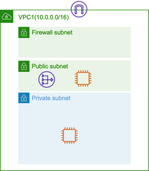

# AWS Network Firewall Demo 

This is a demo of AWS Network Firewall. It includes demo instructions and a CloudFormation template.

- Demo1: Create a VPC and configure Network firewll on the VPC 

# Demo1: Configure Network Firewall



## How to demo

- Step1: Create a stack using Demo1-NetworkFirewall.yaml in Tokyo region
  ```
  export STACK_NAME=network-firewall-demo
  aws cloudformation create-stack --stack-name $STACK_NAME --template-body file://Demo1-NetworkFirewall.yaml --capabilities CAPABILITY_NAMED_IAM --region ap-northeast-1
  ```
